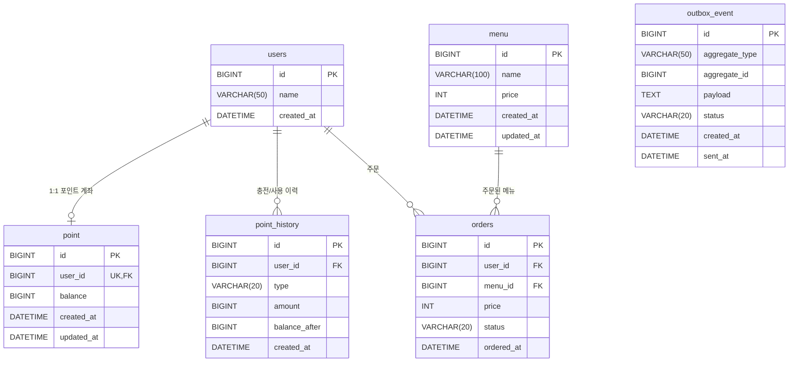

# 커피숍 주문 시스템

## 1. 프로젝트 소개

커피 메뉴 조회, 포인트 충전, 포인트 결제 기반 주문, 주문 데이터 비동기 전송을 제공하는 백엔드 시스템입니다.  
**다수의 서버 인스턴스 환경에서 포인트 잔액의 정합성을 보장**하는 것이 핵심 요구사항이며, Redisson 분산 락과 Outbox 패턴을 적용하여 해결했습니다.

---

## 2. 기술 스택

| 구분 | 기술 | 선택 이유 |
|------|------|----------|
| Language | Java 21 | Record, 텍스트 블록 등 최신 문법 활용으로 DTO/쿼리 가독성 향상 |
| Framework | Spring Boot 4.0.6 | 생산성 + 풍부한 생태계 (JPA, Redis, Validation, Scheduling) |
| ORM | Spring Data JPA | 반복적 CRUD 제거 + native query로 복잡 집계 대응 |
| DB | MySQL | RDBMS 기반 트랜잭션 ACID 보장, 포인트 잔액 정합성의 기반 |
| Cache / Lock | Redis + Redisson | 분산 환경에서 캐시와 분산 락을 단일 인프라로 해결 |
| API 문서 | springdoc-openapi (Swagger UI) | 코드 기반 자동 문서화, 별도 유지보수 불필요 |
| 테스트 | JUnit 5 + Mockito + WireMock | 단위/통합/동시성 테스트를 레이어별로 분리 |

---

## 3. 실행 방법

### 사전 조건

| 소프트웨어 | 버전 | 용도 |
|-----------|------|------|
| Java | 21+ | 애플리케이션 빌드/실행 |
| MySQL | 8.0+ | 메인 데이터 저장소 |
| Redis | 7.0+ | 캐시 + 분산 락 |

### 3-1. MySQL 데이터베이스 생성

```sql
CREATE DATABASE IF NOT EXISTS coffee_shop;
CREATE DATABASE IF NOT EXISTS coffee_shop_test;  -- 테스트용
```

> 기본 접속 정보: `root` / `root` / `localhost:3306`  
> 변경이 필요하면 `src/main/resources/application.yml`의 `spring.datasource` 섹션을 수정하세요.

### 3-2. Redis 실행 확인

```bash
redis-cli ping
# 응답: PONG
```

> 기본 접속 정보: `localhost:6379` (인증 없음)

### 3-3. 애플리케이션 빌드 및 실행

```bash
# 프로젝트 루트에서
./gradlew bootRun
```

서버가 정상 기동되면 콘솔에 다음이 출력됩니다:
```
Started CoffeeShopApplication in X.XXX seconds
```

> **테이블 자동 생성:** `schema.sql`이 서버 시작 시 자동 실행되어 6개 테이블을 생성합니다 (`CREATE TABLE IF NOT EXISTS`).  
> **초기 데이터:** `data.sql`이 테스트 유저 2명, 포인트, 메뉴 5종을 `INSERT IGNORE`로 삽입합니다.

### 3-4. Swagger UI 접속

```
http://localhost:8080/swagger-ui.html
```

4개 API 그룹(Menu, Point, Order)을 UI에서 바로 호출하고 응답을 확인할 수 있습니다.

### 3-5. 테스트 실행

```bash
# 단위 테스트만 (DB/Redis 불필요)
./gradlew test --tests "*.PointServiceTest" --tests "*.OrderServiceTest"

# 전체 테스트 (MySQL coffee_shop_test DB + Redis 필요)
./gradlew test
```

---

## 4. ERD



### 테이블 설계 의도

| 테이블 | 역할 | 비고 |
|--------|------|------|
| `users` | 사용자 마스터 | 최소 필드 — 과제 스코프에서 인증 불필요 |
| `menu` | 커피 메뉴 카탈로그 | 가격 변경 이력은 과제 밖 |
| `point` | 유저별 포인트 잔액 | `user_id` UNIQUE — 유저당 단일 계좌 |
| `point_history` | 충전/사용 이력 (원장) | `balance_after`로 시점별 잔액 추적 가능 |
| `orders` | 주문 기록 | 결제 완료된 가격을 스냅샷으로 저장 |
| `outbox_event` | 비동기 전송 보장 큐 | Outbox 패턴의 핵심 — 트랜잭션과 전송 의도를 묶음 |

---

## 5. API 명세

| API | Method | Endpoint | 설명 |
|-----|--------|----------|------|
| 메뉴 목록 조회 | GET | `/api/menus` | 전체 커피 메뉴 조회 (Redis 캐시 1시간) |
| 인기 메뉴 조회 | GET | `/api/menus/popular` | 최근 7일 주문 TOP 3 (Redis 캐시 5분) |
| 포인트 충전 | PATCH | `/api/points/{userId}/charge` | 포인트 충전 (분산 락 적용) |
| 커피 주문/결제 | POST | `/api/orders` | 포인트 차감 + 주문 생성 + Outbox 이벤트 |

### 요청/응답 예시

#### 메뉴 목록 조회

```http
GET /api/menus
```

```json
{
  "status": 200,
  "data": [
    { "id": 1, "name": "아메리카노", "price": 4500 },
    { "id": 2, "name": "카페라떼", "price": 5000 },
    { "id": 3, "name": "바닐라라떼", "price": 5500 }
  ]
}
```

#### 인기 메뉴 조회

```http
GET /api/menus/popular
```

```json
{
  "status": 200,
  "data": [
    { "rank": 1, "menuId": 1, "menuName": "아메리카노", "orderCount": 142 },
    { "rank": 2, "menuId": 3, "menuName": "바닐라라떼", "orderCount": 98 },
    { "rank": 3, "menuId": 2, "menuName": "카페라떼", "orderCount": 75 }
  ]
}
```

#### 포인트 충전

```http
PATCH /api/points/1/charge
Content-Type: application/json

{ "amount": 10000 }
```

```json
{
  "status": 200,
  "data": {
    "userId": 1,
    "balance": 60000
  }
}
```

#### 커피 주문/결제

```http
POST /api/orders
Content-Type: application/json

{ "userId": 1, "menuId": 3 }
```

```json
{
  "status": 201,
  "data": {
    "orderId": 1,
    "userId": 1,
    "menuId": 3,
    "menuName": "바닐라라떼",
    "price": 5500,
    "remainingBalance": 44500,
    "orderedAt": "2026-05-06T10:30:00"
  }
}
```

#### 에러 응답 (공통)

```json
{
  "status": 400,
  "code": "INSUFFICIENT_BALANCE",
  "message": "잔액이 부족합니다. (현재: 3000P, 필요: 5500P)"
}
```

---

## 6. 문제 해결 전략

### 6-1. 동시성 제어 — Redisson 분산 락

#### 왜 분산 락인가

과제 요구사항은 **"다수의 서버에 다수의 인스턴스"** 환경에서 포인트 잔액의 정합성을 보장하는 것입니다. 단일 JVM의 `synchronized`나 단일 DB의 `SELECT ... FOR UPDATE`로는 다중 인스턴스 간 동시성을 제어할 수 없습니다. Redis 기반 분산 락은 모든 인스턴스가 공유하는 외부 코디네이터 역할을 합니다.

#### 락 키 설계

```
point:lock:{userId}
```

- **유저 단위 격리:** 서로 다른 유저의 충전/주문은 동시에 처리됩니다. 글로벌 락이 아닌 유저별 락으로 병렬 처리량을 최대화합니다.
- **충전과 주문이 같은 락 키를 공유:** 동일 유저에 대해 충전(`PointService`)과 주문(`OrderService`)이 동시에 실행되면 잔액 정합성이 깨질 수 있습니다. 같은 `point:lock:{userId}` 키를 사용하여 한 유저의 잔액에 대한 모든 변경을 직렬화합니다.

#### 트랜잭션과 락의 관계

```
락 획득 → 트랜잭션 시작 → 비즈니스 로직 → 트랜잭션 커밋 → 락 해제
```

트랜잭션 커밋이 확정된 후에 락을 해제해야 합니다. 커밋 전에 락이 풀리면 다른 스레드가 커밋되지 않은(= 아직 DB에 반영되지 않은) 데이터를 읽을 수 있습니다.

이를 보장하기 위해 `PointChargeExecutor` / `OrderExecutor`를 **별도 @Component로 분리**했습니다:

| 구조 | 문제점 |
|------|--------|
| 같은 클래스 내 `@Transactional` 메서드 호출 | Spring AOP 프록시를 타지 않음 → `@Transactional`이 동작하지 않음 |
| 별도 클래스(`Executor`)로 분리 | 외부 빈 호출 → 프록시 정상 동작 → 트랜잭션 경계 확실 |

#### 락 파라미터

| 파라미터 | 값 | 의미 |
|---------|---|------|
| waitTime | 5초 | 락 획득 대기 시간. 초과 시 409 응답 |
| leaseTime | 3초 | 락 점유 시간. Redisson Watchdog이 작업 진행 중이면 자동 연장 |

#### 대안 비교

| 대안 | 장점 | 이 과제에서 선택하지 않은 이유 |
|------|------|--------------------------|
| 낙관적 락 (`@Version`) | DB 레벨 충돌 감지, 락 대기 없음, 읽기 성능 우수 | 충돌 시 재시도 로직을 애플리케이션이 직접 구현해야 함. 동시 충전 빈도가 높은 시나리오에서 재시도 비용이 누적되어 오히려 처리량이 감소. 또한 다중 인스턴스 환경에서 재시도 중 다른 인스턴스와 다시 충돌할 확률이 증가 |
| 비관적 락 (`SELECT ... FOR UPDATE`) | 구현 단순, 추가 인프라 불필요, 단일 DB 환경에서 효과적 | DB 커넥션을 락 해제까지 점유하여 커넥션 풀 고갈 위험. 다중 인스턴스가 동일 row에 대해 경합하면 DB에 부하 집중. **단일 DB 인스턴스라면 이 방식이 가장 적정한 선택**이지만, 과제의 "다수 인스턴스" 요구사항에서는 DB 외부의 코디네이터가 더 적합 |
| **Redisson 분산 락** | **선택** — 다중 인스턴스 환경에서 DB 부하 없이 동시성 제어. Watchdog으로 데드락 방지. 락 대기/점유 시간을 세밀하게 제어 가능 | Redis 단일 장애점(SPOF) 위험. 실무에서는 Redis Sentinel/Cluster 또는 RedLock 알고리즘으로 보완 필요 |

> **자각:** 현재 과제는 단일 MySQL + 단일 Redis 환경입니다. 순수 기술적으로만 보면 `FOR UPDATE`가 인프라 복잡도 대비 가장 효율적인 선택입니다. 그러나 과제가 "다수의 서버 인스턴스"를 전제하고 있으므로, **수평 확장 시에도 변경 없이 동작하는 분산 락**을 적용했습니다.

---

### 6-2. 데이터 전송 — Outbox 패턴

#### 왜 트랜잭션 밖으로 전송을 분리했는가

외부 데이터 플랫폼 API가 장애 상태일 때, 주문 트랜잭션까지 실패하면 안 됩니다. 주문/결제는 핵심 비즈니스이고, 데이터 전송은 부가 기능입니다. 두 관심사의 생명주기를 분리해야 합니다.

#### Outbox 패턴이란

트랜잭션 안에서 "이 데이터를 나중에 전송하겠다"는 **의도(OutboxEvent)를 DB에 기록**합니다. 별도 스케줄러가 이 테이블을 폴링하여 실제 전송을 수행합니다. 전송이 비즈니스 트랜잭션과 독립적이면서도, "전송 의도" 자체는 트랜잭션에 포함되어 유실되지 않습니다.

#### 전송 파이프라인

```
┌─────────────────────────────────────────────────────┐
│ 주문 트랜잭션 (@Transactional)                        │
│                                                     │
│  1. Point.deduct() — 포인트 차감                      │
│  2. PointHistory INSERT — 사용 이력 기록               │
│  3. Order INSERT — 주문 생성                          │
│  4. OutboxEvent INSERT (status = PENDING) — 전송 의도  │
│                                                     │
│  → COMMIT                                           │
└─────────────────────────────────────────────────────┘

┌─────────────────────────────────────────────────────┐
│ OutboxScheduler (5초 간격 폴링)                        │
│                                                     │
│  1. SELECT * FROM outbox_event WHERE status = 'PENDING' │
│  2. 각 이벤트에 대해:                                   │
│     → DataPlatformClient.send(payload) — HTTP POST   │
│     → 성공: markSent() → status = 'SENT'             │
│     → 실패: markFailed() → status = 'FAILED'         │
└─────────────────────────────────────────────────────┘
```

#### 대안 비교

| 대안 | 장점 | 이 과제에서 선택하지 않은 이유 |
|------|------|--------------------------|
| 동기 전송 (트랜잭션 내 HTTP 호출) | 구현 가장 단순, 즉시 전송 확인 가능 | 외부 API 응답 시간이 트랜잭션 지속 시간에 직접 합산됨. API 장애/타임아웃 시 주문 자체가 롤백되어 사용자 경험 저하. DB 커넥션 점유 시간 증가 |
| `@TransactionalEventListener` | 커밋 성공 후 이벤트 발행, 트랜잭션과 자연스럽게 연동 | 전송 실패 시 재시도 메커니즘이 없음. 서버가 커밋 직후 크래시하면 이벤트 유실. 스케줄 기반 재시도를 별도 구현해야 하며 결국 Outbox와 유사한 구조가 됨 |
| **Outbox 폴링** | **선택** — 트랜잭션 내 전송 의도 보장, 서버 장애에도 PENDING 이벤트가 DB에 남아 복구 가능, 구현 복잡도 적정 | 폴링 간격(5초)만큼의 전송 지연 발생. 이벤트 양이 극대화되면 DB 폴링 부하 증가 |
| Outbox + CDC (Debezium) | DB 변경 로그를 실시간 캡처하여 지연 최소화, 폴링 부하 없음 | Kafka Connect + Debezium 인프라 필요. 과제 스케일 대비 과도한 복잡도. 운영 중 스키마 변경 시 CDC 설정 동기화 필요 |
| Kafka (직접 Produce) | 높은 처리량, 소비자 확장 용이, 메시지 순서 보장 | 메시지 브로커 인프라 추가. 트랜잭션 커밋과 메시지 발행 사이의 원자성을 보장하려면 결국 Outbox 또는 Transactional Outbox가 필요 (dual write 문제). 과제 스코프에서 Kafka를 도입하는 것은 과설계 |

#### At-Least-Once와 멱등성

Outbox 폴링은 **at-least-once** 전송을 보장합니다. 스케줄러가 전송 후 `markSent()`를 호출하기 전에 서버가 크래시하면, 다음 폴링에서 동일 이벤트를 재전송할 수 있습니다.

수신 측에서 멱등성을 보장해야 하며, 일반적으로 `outbox_event.id` 또는 `aggregate_id`를 중복 키로 사용합니다. 이 과제에서는 Mock 수신자이므로 별도 중복 처리를 구현하지 않았습니다.

---

### 6-3. 캐싱 전략

#### 정합성 수준의 의식적 차등 설계

이 시스템의 데이터는 **요구되는 정합성 수준이 다릅니다.** 모든 데이터에 동일한 전략을 적용하는 것은 불필요한 비용을 초래하거나, 반대로 안전하지 않습니다.

| 데이터 | 정합성 요구 | 부정확 시 비즈니스 영향 | 적용 전략 |
|--------|-----------|---------------------|----------|
| **포인트 잔액** | 강한 정합성 (Strong Consistency) | 초과 차감 → 금전적 손실 발생, 즉시 고객 민원 | 분산 락으로 직렬화. 캐시 사용하지 않음 — 항상 DB에서 최신 값을 읽음 |
| **메뉴 목록** | 약한 정합성 허용 (TTL 1시간) | 메뉴 가격/이름이 1시간 이내 지연 반영 | Redis 캐시. 메뉴 변경은 거의 없으므로 TTL 만료로 충분 |
| **인기 메뉴 순위** | Eventual Consistency 허용 (TTL 5분) | 순위가 최대 5분간 이전 상태 — 사용자 불편 없음 | DB 집계 + Redis 캐시 |

#### 왜 이 수준의 차등이 적정한가

**포인트 잔액:** 금전적 가치와 직결됩니다. 두 인스턴스가 동시에 "잔액 10,000"을 읽고 각각 5,500을 차감하면, 실제로는 11,000이 차감되어야 하지만 잔액이 4,500으로 기록됩니다. 캐시를 두면 이 위험이 증가하므로, **포인트 잔액은 캐시하지 않고 매번 DB에서 읽으며 분산 락으로 직렬화**합니다.

**인기 메뉴 순위:** 7일 윈도우로 집계합니다. 5분 캐시가 만료되는 시점에 순위가 바뀌어도, 7일간의 누적 데이터이므로 급격한 변동이 없습니다. **7일 윈도우가 5분 TTL의 부정확성을 자연스럽게 흡수**합니다. 반면 매 요청마다 `GROUP BY + ORDER BY + JOIN` 집계 쿼리를 실행하면 DB 부하가 급증합니다.

**메뉴 목록:** 커피숍 메뉴는 하루에 한 번도 변경되지 않는 것이 일반적입니다. TTL 1시간은 충분히 보수적이면서도 DB 부하를 효과적으로 줄입니다.

#### 캐시 설정 요약

| 캐시 이름 | TTL | 대상 | 무효화 전략 |
|----------|-----|------|-----------|
| `menus` | 1시간 | 전체 메뉴 목록 | TTL 만료 (메뉴 변경 API 없음) |
| `popularMenus` | 5분 | 인기 메뉴 TOP 3 | TTL 만료 |

#### 왜 Local Cache가 아닌 Redis Cache인가

다중 인스턴스 환경에서 Local Cache(Caffeine, Guava 등)를 사용하면 인스턴스 간 캐시 불일치가 발생합니다. 인스턴스 A에서 주문이 발생해도 인스턴스 B의 인기 메뉴 캐시에는 반영되지 않습니다. Redis를 중앙 캐시로 사용하면 모든 인스턴스가 동일한 캐시 데이터를 공유합니다.

---

### 6-4. 인덱스 설계

#### 복합 인덱스

```sql
INDEX idx_order_status_ordered_at_menu_id (status, ordered_at, menu_id)
```

#### 설계 근거

인기 메뉴 집계 쿼리:
```sql
SELECT o.menu_id, m.name, COUNT(*)
FROM orders o JOIN menu m ON o.menu_id = m.id
WHERE o.status = 'COMPLETED'          -- (1) 등가 조건
  AND o.ordered_at >= :since           -- (2) 레인지 스캔
GROUP BY o.menu_id, m.name             -- (3) 그룹핑
ORDER BY COUNT(*) DESC
LIMIT 3
```

인덱스 컬럼 순서의 논리:

| 순서 | 컬럼 | 이유 |
|------|------|------|
| 1번 | `status` | 등가 조건 (`= 'COMPLETED'`)은 인덱스 선두에 배치해야 B-Tree에서 정확한 분기 가능 |
| 2번 | `ordered_at` | 레인지 조건 (`>= 7일 전`)으로 스캔 범위를 제한. 등가 조건 뒤에 위치해야 레인지 스캔이 효율적 |
| 3번 | `menu_id` | `GROUP BY` 대상. 인덱스에 포함되어 있으면 정렬 없이 그룹핑 가능 (Index Grouping) |

이 인덱스로 쿼리는 `status = 'COMPLETED'`인 범위에서 `ordered_at >= 7일 전`인 레코드만 스캔하며, `menu_id`까지 인덱스에 포함되어 커버링에 가까운 효율을 얻습니다.

#### 기타 인덱스

| 인덱스 | 대상 쿼리 |
|--------|----------|
| `uk_point_user_id` (UNIQUE) | `findByUserId()` — 포인트 조회/충전/차감 |
| `idx_point_history_user_id` | 포인트 이력 조회 (향후 확장) |
| `idx_outbox_status_created_at` | 스케줄러 폴링 (`WHERE status = 'PENDING' ORDER BY created_at`) |

---

## 7. 테스트

| 테스트 클래스 | 유형 | 검증 포인트 | DB/Redis 필요 |
|-------------|------|----------|:---:|
| `PointServiceTest` | 단위 (Mockito) | 충전 성공, 유저 미존재 예외, 금액 부적절 예외, 락 획득 실패 예외 | X |
| `OrderServiceTest` | 단위 (Mockito) | 주문 성공, 유저 미존재 예외, 메뉴 미존재 예외 | X |
| `PointConcurrencyTest` | 동시성 (SpringBootTest) | 10개 스레드 동시 충전 → 최종 잔액이 `10 × 충전액`과 정확히 일치 | O |
| `OutboxIntegrationTest` | 통합 (WireMock) | 주문→PENDING→스케줄러 전송→SENT 전환, 전송 실패 시 FAILED 마킹 | O |

### 동시성 테스트 상세

```
[Thread 1] charge(userId=1, 1000) ──┐
[Thread 2] charge(userId=1, 1000) ──┤
[Thread 3] charge(userId=1, 1000) ──┤── Redisson 분산 락에 의해 직렬화
...                                 │
[Thread 10] charge(userId=1, 1000) ─┘

초기 잔액: 0
기대 최종 잔액: 10,000 (= 10 × 1,000)
```

분산 락이 없으면 Lost Update가 발생하여 최종 잔액이 10,000보다 작아집니다. 이 테스트는 락이 정확히 동작하는지를 검증합니다.

---

## 8. 개선 포인트

시간이 더 있었다면 고려할 항목들입니다:

| 개선 사항 | 현재 상태 | 개선 방향 |
|----------|----------|----------|
| Outbox FAILED 재시도 | 실패 시 FAILED 마킹 후 방치 | 지수 백오프(1분 → 2분 → 4분) + 최대 재시도 횟수 제한 + Dead Letter 처리 |
| Outbox CDC 전환 | 5초 폴링 기반 | Debezium CDC로 실시간 전송, 폴링 부하 제거 |
| 도메인 경계 정비 | OrderExecutor가 PointRepository 직접 참조 | PointDeductService 인터페이스 분리로 도메인 간 의존성 역전 |
| 부하 테스트 | 동시성 테스트 10스레드 | k6/Gatling으로 실제 부하 프로파일 기반 성능 측정 |
| Redis 고가용성 | 단일 Redis 인스턴스 | Redis Sentinel 또는 Cluster 구성으로 SPOF 제거 |
| 캐시 무효화 | TTL 만료 기반 | 메뉴 변경 이벤트 발행 시 명시적 캐시 무효화 (Cache Eviction) |
| 모니터링 | 로그 기반 | Outbox 전송 성공률, 락 획득 대기 시간 등 메트릭 수집 (Micrometer + Grafana) |
